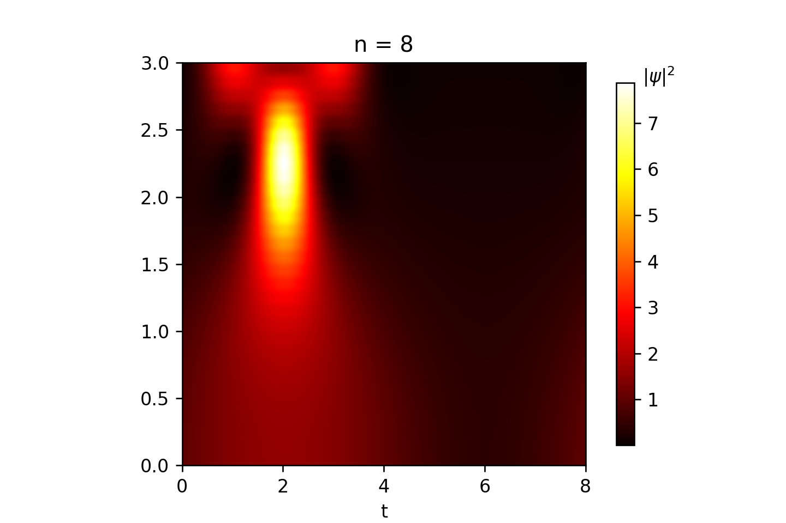

# Toward Cosmological Simulations of Dark Matter on Quantum Computers

Paper: Philip Mocz and Aaron Szasz 2021 ApJ 910 29

"Spectral Solver for Schrodinger-Poisson Quantum System" by Philip Mocz

Adapted by Óscar Amaro to reproduce results from the paper

[Medium](https://levelup.gitconnected.com/create-your-own-quantum-mechanics-simulation-with-python-51e215346798)

